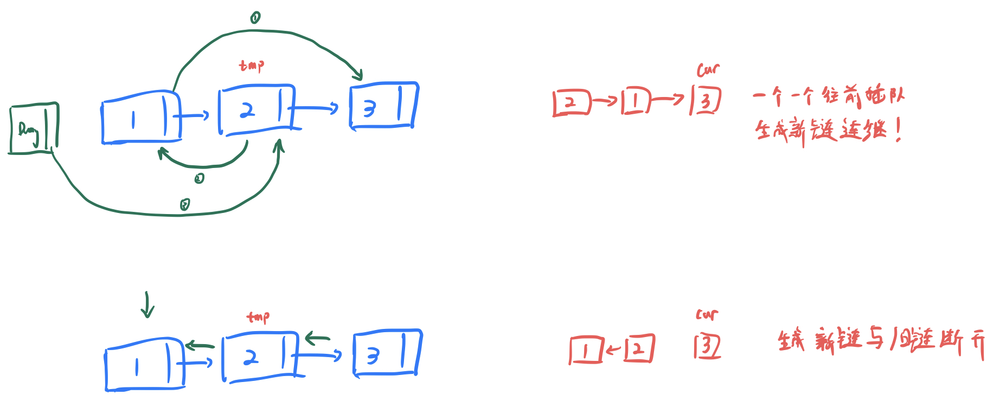

# 牛客网刷题

## NC50

需要使用dummy指针加单个插入的方法，生成的链表连续不会断开，比较好处理

旋转链表优化方案：

```c++
class Solution {
public:
  ListNode *ReverseList(ListNode *p_head) {
    if (!p_head) return p_head;
    ListNode *dummy = new ListNode(0);
    dummy->next = p_head;
    ListNode *p_node = p_head, *p_tmp;
    while (p_node->next) {
       p_tmp = p_node->next;
       p_node->next = p_node->next->next;
       p_tmp->next = dummy->next;
       dummy->next = p_tmp;
    }
    p_head = dummy->next;
    delete dummy;
    return p_head;
  }
};
```

# 

